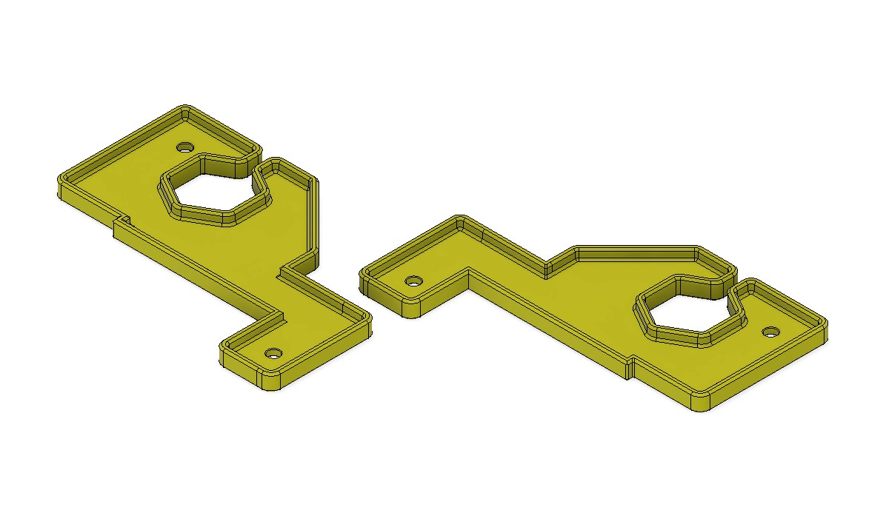

# Belt cover for brackets

A modified Voron v2.2 belt cover that works with the large corner brackets from Misumi.

## BOM
- 8 of M3x8
- 8 of M3 T-nut

## Credit

This design is based upon Voron V2.2 design.