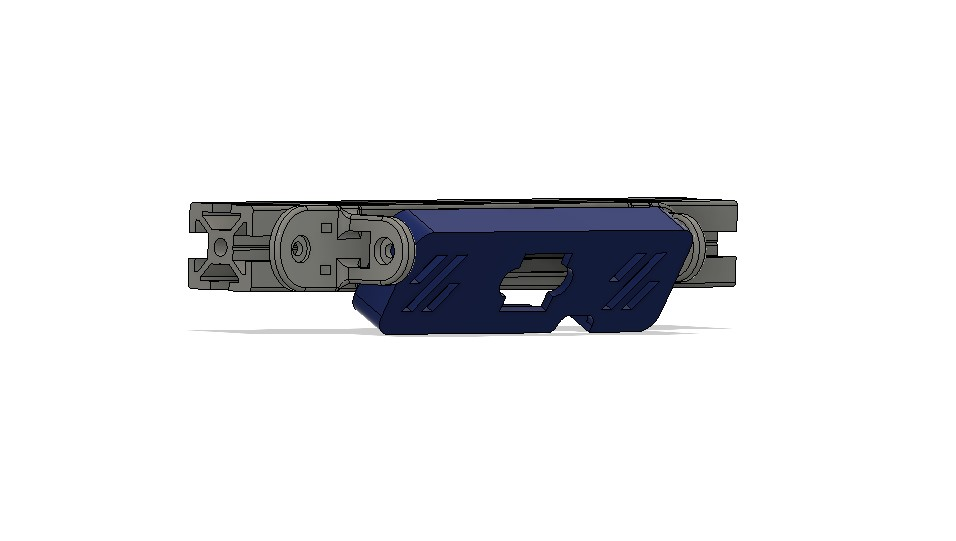

# C920 PCB mount

A simple thing to mount the c920 camera pcb to an 2020 extrusion.

## BOM
- 2 of M3 heatset insert
- 1 of small ziptie
- 4 of M3X10 SHCS
- 2 of M2x8 self tapping screw
- 2 of M3 T-nut
- 1 of Logitech C920 stripped to it's bare PCB.

## Info

Strip the camera to it's bare PCB by following this guide https://www.ifixit.com/Guide/Logitech+C920+Webcam+Disassembly/115077

## Credit

This design is based upon hartk's excellent mount for the voron camera at https://github.com/hartk1213/MISC/tree/main/Voron%20Mods/Non%20Printer%20Voron%20Stuff/Voron_Camera