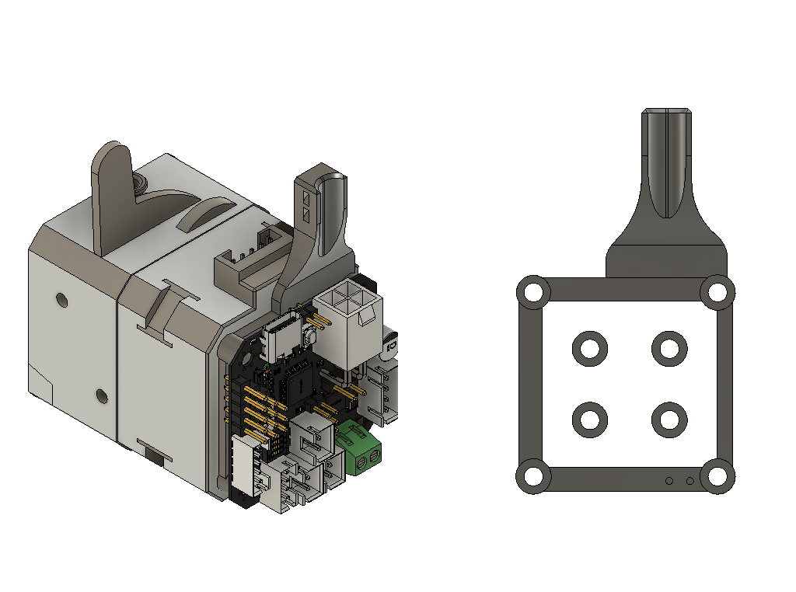
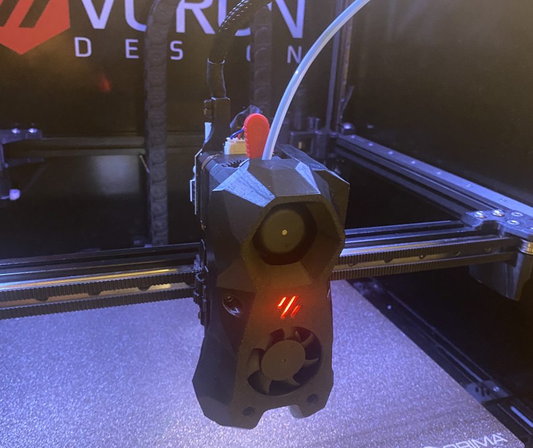

# EBB42 mount for Bondtech LGX

A simple thing to mount the EBB42 to an Bondtech LGX.

## BOM
- 4x M3x30 SHCS
- 2x small zipties

## Print guide

Print it in ABS since the LGX steppermotor runs hot.

## Mounting

Remove the four screws from the LGX and mount the mount with the spacers behind it.

## Credit

This design is somewhat a remix of KayosMaker excellent EBB32 mounts at https://github.com/KayosMaker/CANboard_Mounts/tree/main/STLs/BTT_EBB36_Mounts