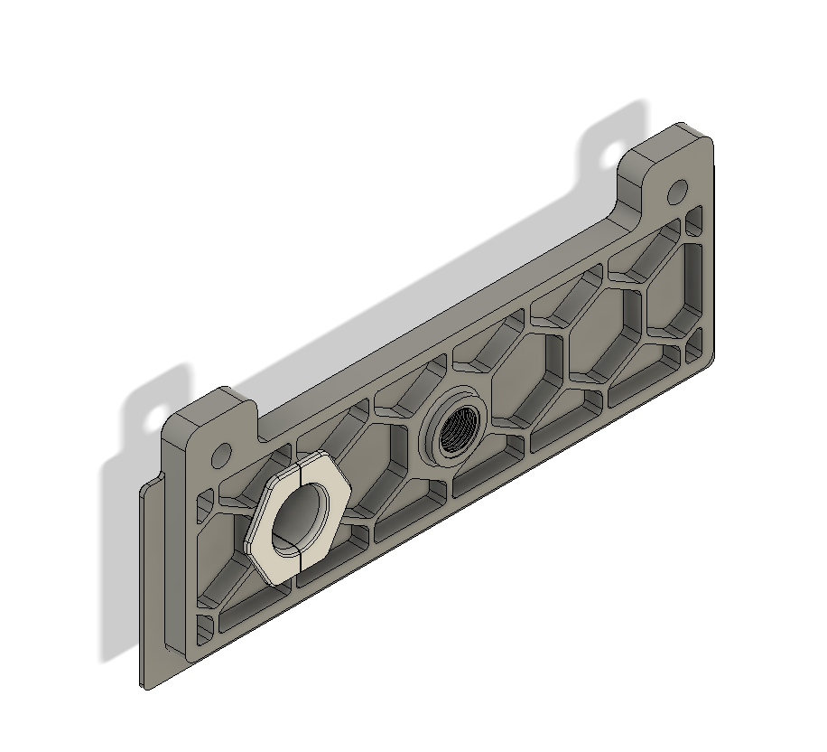

# Exhaust with parametric umbilical passthrough

This is a combo mod of https://github.com/VoronDesign/VoronUsers/tree/main/printer_mods/Fiction/Exhaust_cover and https://www.printables.com/model/862631-parametric-umbilical-passthrough where i hacked themtogether.

Dimensions for the hole:

- ID: 7mm
- OD: 16mm

## BOM
- 1 of Threaded Push-fit Connector for reversed bowden
- 2 of M5x12
- 2 of M5 T-nut

## Credit

All credit to Fiction and 10suo. I just hacked it together.