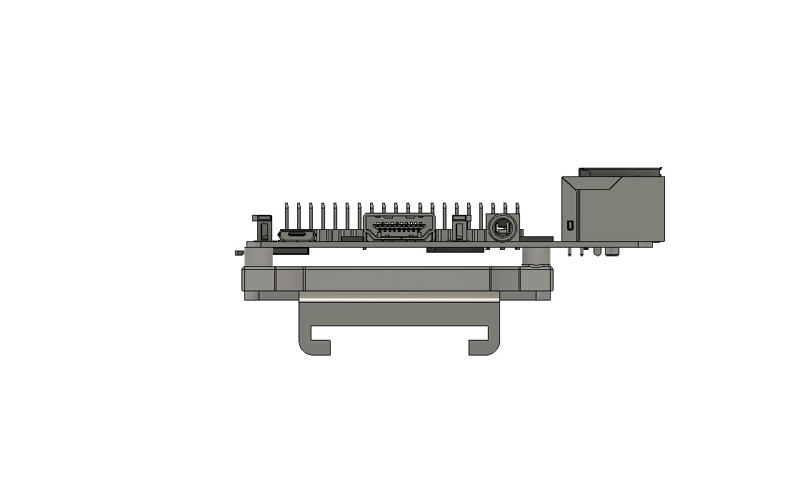

# Raspberry Pi SSR mount

A simple thing to mount the Raspberry pi to an SSR mount.

## BOM
- 2 of M4 screws
- 4 of M3 screws
- 4 of M3 heatset insert

## Info

Not all SSR mounts are the same, so you may need to edit it to fit your mount.