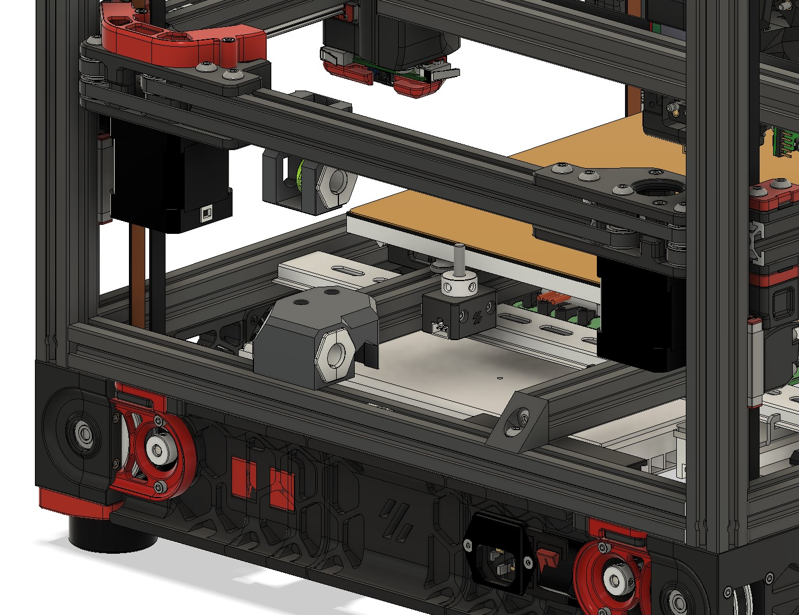

# Umbilical Z with parametric umbilical passthrough

This is a combo mod of https://github.com/hartk1213/MISC/tree/main/Voron%20Mods/Voron%202-Trident/2.4/Voron2.4_Z_Umbilical and https://www.printables.com/model/862631-parametric-umbilical-passthrough where i hacked themtogether.

The hole is set to 15mm in STL and CAD.

## BOM
- 5 of M3x8
- 5 of M3 T-nut

## Credit

All credit to hartk and 10suo. I just hacked it together.